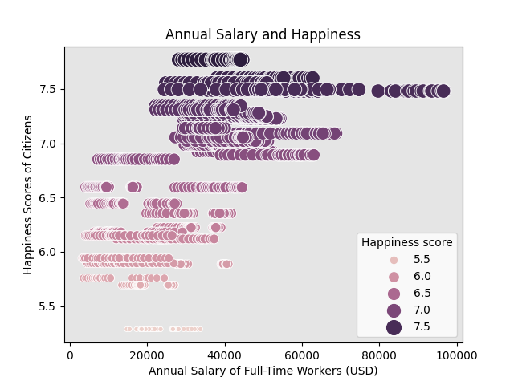

# Money-vs-Happiness

This visualization asks the question, "Does salary equate to happiness?" This project was a lesson in using Pandas to merge, group and analyze date from csv files. The csv files
were merged together to determine the relationship between salary and happiness. It is a Bubble Plot visualization using the Seaborn ```scatterplot()``` function.

## Modules/Libraries:

* Request
* Pandas
* Matplotlib
* Seaborn (Scatterplot)
* CSV files


